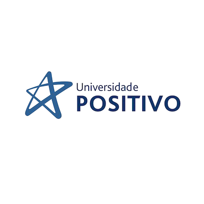

class: title-slide-light, top

```{r xaringan-themer, include=FALSE, warning=FALSE}
require(xaringanthemer)
style_duo_accent(
  primary_color   = "#050A59",   # azul mais escuro — títulos / fundo das seções
  secondary_color = "#074073",   # azul médio        — realces / links
  header_color    = "#050A59",
  text_color      = "#032059",   # azul escuro       — texto principal (alto contraste)
  code_inline_color = "#074073",
  link_color      = "#074073",
  header_font_google = google_font("Josefin Sans"),
  text_font_google   = google_font("Montserrat", "400", "400i"),
  code_font_google   = google_font("Fira Mono"),
  base_font_size = "22px",
  text_slide_number_color = "#F2F2F2",
  colors = c(
    escuro     = "#050A59",
    azulescuro = "#032059",
    azulmedio  = "#074073",
    azulclaro  = "#2E608C",
    cinza      = "#F2F2F2"
  )
)
style_extra_css(
  css = list(
    ".header" = list(position = "fixed", left = 0, top = 0, height = "5%",
                     width = "100%", color = "#F2F2F2", "line-height" = "40px",
                     "font-family" = '"Josefin Sans", serif', "text-align" = "left",
                     "background-color" = "#050A59", "font-size" = "15px", "z-index" = "1000"),
    ".footer" = list(position = "fixed", left = 0, bottom = 0, height = "5%",
                     width = "100%", color = "#F2F2F2", "line-height" = "30px",
                     "font-family" = '"Montserrat", serif', "text-align" = "left",
                     "background-color" = "#032059", "font-size" = "13px", "z-index" = "1000")
  )
)
```

```{css, echo=FALSE}
/* =============== Identidade visual UP — refinada e legível =============== */
/* --- Ritmo e hierarquia tipográfica --- */
.remark-slide-content { line-height: 1.5; }
.remark-slide-content h1 { font-weight: 700; letter-spacing: 0.4px; }
.remark-slide-content h2 {
  font-size: 1.55em; font-weight: 700; color: #050A59;
  margin: 0.2em 0 0.7em; padding-bottom: 0.16em;
  border-bottom: 2px solid #074073;
}
.remark-slide-content h3 { font-weight: 600; color: #032059; }
.remark-slide-content li { margin-bottom: 0.32em; }
strong { color: #050A59; }
/* --- Blocos de código --- */
.remark-code {
  border: 1px solid #D8E0EA; border-radius: 8px;
  box-shadow: 0 1px 3px rgba(5,10,89,0.06);
}
.tiny .remark-code  { font-size: 62%; }
.small .remark-code { font-size: 80%; }
/* Destaque progressivo de linha (highlight) — realce claro sobre código */
.remark-code-line-highlighted {
  background-color: #E6EEF6;
  border-left: 4px solid #074073;
}
/* --- Slides de seção: fundo claro + acento institucional no topo --- */
.remark-slide-content.inverse {
  background-color: #FFFFFF;
  color: #050A59;
  border-top: 6px solid #074073;
}
.inverse h1, .inverse h2, .inverse h3 { color: #050A59; }
.inverse h2 { border-bottom: none; }
.inverse strong { color: #050A59; }
.inverse a, .inverse .ref { color: #074073; }
.inverse .fa-check-circle { color: #074073; margin-right: 6px; }
/* --- Slide de abertura (fundo claro) --- */
.title-slide-light { background-color: #FFFFFF; }
.title-slide-light h1 { color: #050A59; font-size: 2.55em; margin-bottom: 0.1em; }
.title-slide-light h3 { color: #074073; font-weight: 500; }
.title-logo { display: block; margin: 0.2em auto 0.3em; width: 140px; }
/* --- Logo no canto dos slides de conteúdo (fundo claro) --- */
.remark-slide-content:not(.inverse):not(.title-slide-light)::after {
  content: ""; position: absolute; top: 46px; right: 28px;
  width: 112px; height: 32px;
  background: url("up_logo.png") right center / contain no-repeat;
  opacity: 0.9;
}
/* --- Caixa de destaque conceitual --- */
.destaque {
  background: #F4F6FA; border-left: 5px solid #074073;
  padding: 12px 18px; border-radius: 8px; color: #032059;
}
.inverse .destaque {
  background: #F4F6FA; border-left-color: #074073; color: #032059;
}
/* --- Caixa de pergunta / verificação (fundo escuro, texto claro) --- */
.pergunta {
  background: #050A59; color: #F2F2F2; border-radius: 10px;
  padding: 16px 22px; font-size: 1.02em;
}
.pergunta strong { color: #FFFFFF; }
/* --- Rótulo discreto de etapa do laço (sem pílula colorida) --- */
.passo { color: #074073; font-weight: 700; }
/* --- Citações ABNT --- */
.ref { display: block; margin-top: 0.7em; font-size: 52%; color: #074073; font-style: italic; }
/* --- Régua --- */
hr { border: none; border-top: 2px solid #074073; margin: 0.5em 0; }

/* --- Compatibilidade com elementos já usados no corpo do documento --- */
/* Cartão branco para a logo no slide de abertura */
.logo-card {
  display: inline-block; background: #FFFFFF;
  padding: 18px 26px; border-radius: 14px;
  box-shadow: 0 4px 14px rgba(5,10,89,0.18);
}
/* Tags de etapa do laço (usadas nos slides do `for`) */
.tag { display:inline-block; padding:2px 10px; border-radius:12px;
       color:#F2F2F2; font-size:80%; }
.t-init { background:#050A59; }
.t-cond { background:#074073; }
.t-corpo{ background:#2E608C; }
.t-inc  { background:#032059; }
```



.center[
# Laços de Repetição em C

### `for` &nbsp;·&nbsp; `while` &nbsp;·&nbsp; `do-while`

**Prof. Bruno Melo** &nbsp;·&nbsp; Universidade Positivo &nbsp;·&nbsp; Processo Seletivo Docente
]

<div style="text-align:center; margin-top: 6px;">
<svg viewBox="0 0 880 240" style="width:72%; max-width:640px; height:auto;" xmlns="http://www.w3.org/2000/svg" role="img" aria-label="Fazer à mão, mês após mês, versus deixar o laço repetir automaticamente.">
  <defs>
    <marker id="seta" markerWidth="9" markerHeight="9" refX="7" refY="4.5" orient="auto">
      <polygon points="0 0, 9 4.5, 0 9" fill="#074073"/>
    </marker>
  </defs>

  <!-- ===== Painel esquerdo: à mão ===== -->
  <text x="118" y="30" text-anchor="middle" font-family="Montserrat, sans-serif" font-size="13" font-weight="700" letter-spacing="1.5" fill="#074073">À MÃO</text>

  <rect x="30" y="46" width="176" height="150" rx="10" fill="#F4F6FA" stroke="#074073" stroke-width="2.5"/>
  <text x="48" y="72" font-family="Montserrat, sans-serif" font-size="12" font-weight="700" letter-spacing="0.5" fill="#074073">MINHA POUPANÇA</text>
  <line x1="48" y1="80" x2="188" y2="80" stroke="#D8E0EA" stroke-width="1.5"/>
  <text x="48" y="104" font-family="'Fira Mono', monospace" font-size="14" fill="#032059">Mês 1 -&gt; R$ 300</text>
  <text x="48" y="128" font-family="'Fira Mono', monospace" font-size="14" fill="#032059">Mês 2 -&gt; R$ 600</text>
  <text x="48" y="152" font-family="'Fira Mono', monospace" font-size="14" fill="#032059">Mês 3 -&gt; R$ 900</text>
  <text x="48" y="178" font-family="'Fira Mono', monospace" font-size="15" fill="#074073">...</text>

  <text x="232" y="96"  font-family="Georgia, serif" font-size="15" font-style="italic" fill="#032059" opacity="1">de novo…</text>
  <text x="232" y="122" font-family="Georgia, serif" font-size="15" font-style="italic" fill="#032059" opacity="0.62">de novo…</text>
  <text x="232" y="148" font-family="Georgia, serif" font-size="15" font-style="italic" fill="#032059" opacity="0.42">de novo…</text>
  <text x="232" y="176" font-family="Montserrat, sans-serif" font-size="13" font-weight="600" fill="#074073">…até quando?</text>

  <text x="118" y="224" text-anchor="middle" font-family="Montserrat, sans-serif" font-size="14" font-weight="600" fill="#050A59">somar mês após mês</text>

  <!-- ===== Seta central ===== -->
  <rect x="392" y="86" width="56" height="28" rx="14" fill="#050A59"/>
  <text x="420" y="105" text-anchor="middle" font-family="'Fira Mono', monospace" font-size="15" font-weight="700" fill="#F2F2F2">for</text>
  <line x1="360" y1="126" x2="480" y2="126" stroke="#074073" stroke-width="5" marker-end="url(#seta)"/>
  <text x="420" y="150" text-anchor="middle" font-family="Montserrat, sans-serif" font-size="13" fill="#074073">deixe o laço repetir</text>

  <!-- ===== Painel direito: automático ===== -->
  <text x="688" y="30" text-anchor="middle" font-family="Montserrat, sans-serif" font-size="13" font-weight="700" letter-spacing="1.5" fill="#074073">AUTOMÁTICO</text>

  <rect x="512" y="46" width="336" height="150" rx="12" fill="#F4F6FA" stroke="#074073" stroke-width="2.5"/>
  <text x="532" y="80"  font-family="'Fira Mono', monospace" font-size="15" fill="#050A59">for (int mes = 1;</text>
  <text x="532" y="102" font-family="'Fira Mono', monospace" font-size="15" fill="#050A59">     mes &lt;= 12;</text>
  <text x="532" y="124" font-family="'Fira Mono', monospace" font-size="15" fill="#050A59">     mes++) {</text>
  <text x="550" y="146" font-family="'Fira Mono', monospace" font-size="15" fill="#074073">total += 300;</text>
  <text x="532" y="168" font-family="'Fira Mono', monospace" font-size="15" fill="#050A59">}</text>

  <g>
    <path d="M 828,58 A 15,15 0 1 1 815,84" fill="none" stroke="#2E608C" stroke-width="3.2" stroke-linecap="round"/>
    <polygon points="815,84 807,79 812,92" fill="#2E608C"/>
    <animateTransform attributeName="transform" type="rotate" from="0 822 72" to="360 822 72" dur="2.6s" repeatCount="indefinite"/>
  </g>

  <text x="688" y="224" text-anchor="middle" font-family="Montserrat, sans-serif" font-size="14" font-weight="600" fill="#050A59">o computador repete por você</text>
</svg>
</div>

<p style="text-align:center; font-size:15px; color:#032059; margin:6px 0 0;">
<i>Quantas vezes você já fez a mesma conta, repetindo à mão?</i>
</p>

---
.header[ &nbsp; &nbsp; &nbsp; UNIVERSIDADE POSITIVO — LAÇOS DE REPETIÇÃO EM C ] .footer[ &nbsp; &nbsp; &nbsp; Prof. Bruno Melo — Processo Seletivo Docente ]

## Roteiro da aula

<br>


1. **Por que repetir?**

2. **Lógica antes da sintaxe** 

3. **O `for` passo a passo** 

4. .azulmedio[**Quadro**] — desenhar o fluxo 


<br>

.destaque[
Imagine um simulador de poupança, *quanto tempo você precisa até juntar
dinheiro para comprar um notebook?* 
]

---
class: inverse, middle, center
.header[ &nbsp; &nbsp; &nbsp; UNIVERSIDADE POSITIVO — LAÇOS DE REPETIÇÃO EM C ] .footer[ &nbsp; &nbsp; &nbsp; Prof. Bruno Melo — Processo Seletivo Docente ]

# 1. Por que repetir?

## *Quantas vezes você já fez a mesma coisa, repetindo à mão?*

---
.header[ &nbsp; &nbsp; &nbsp; UNIVERSIDADE POSITIVO — LAÇOS DE REPETIÇÃO EM C ] .footer[ &nbsp; &nbsp; &nbsp; Prof. Bruno Melo — Processo Seletivo Docente ]

## Por que repetir?

<br>

Imagine que você decidiu **juntar dinheiro para comprar um notebook**.

--

Todo mês você guarda um valor e **confere quanto já tem**.

--

Se fôssemos calcular à mão: mês 1... mês 2... mês 3... até bater a meta.

--

<br>

.destaque[
O computador foi feito para isso: **repetir tarefas** com rapidez e sem errar.
A estrutura que expressa "repita" chama-se **laço de repetição** (ou *loop*).
]

.ref[Estruturas de repetição executam um bloco de comandos várias vezes enquanto uma condição se mantém (DEITEL; DEITEL, 2011; ASCENCIO; CAMPOS, 2012).]

---
class: inverse, middle, center
.header[ &nbsp; &nbsp; &nbsp; UNIVERSIDADE POSITIVO — LAÇOS DE REPETIÇÃO EM C ] .footer[ &nbsp; &nbsp; &nbsp; Prof. Bruno Melo — Processo Seletivo Docente ]

# 2. Lógica antes da sintaxe

## *Primeiro pensamos o problema. Depois traduzimos para C, Python, R...*

---
.header[ &nbsp; &nbsp; &nbsp; UNIVERSIDADE POSITIVO — LAÇOS DE REPETIÇÃO EM C ] .footer[ &nbsp; &nbsp; &nbsp; Prof. Bruno Melo — Processo Seletivo Docente ]

## O simulador de poupança

.pull-left[
**O que queremos:**

- Guardar um valor **por mês**
- Somar ao **total acumulado**
- Repetir **enquanto** a meta não for atingida
- Contar **quantos meses** levou
]

.pull-right[
```text
total  <- 0
meses  <- 0

ENQUANTO total < meta FAÇA
    total <- total + mensal
    meses <- meses + 1
    mostrar total
FIM-ENQUANTO

mostrar meses
```
]

.destaque[
Repare: **não sabemos quantos meses serão** e isso depende de uma **condição**.
Essa é a repetição **condicionada**.
]

.ref[O pseudocódigo antecede a implementação e explicita a lógica do algoritmo (ASCENCIO; CAMPOS, 2012).]

---
.header[ &nbsp; &nbsp; &nbsp; UNIVERSIDADE POSITIVO — LAÇOS DE REPETIÇÃO EM C ] .footer[ &nbsp; &nbsp; &nbsp; Prof. Bruno Melo — Processo Seletivo Docente ]

## Duas perguntas, dois laços

<br>

| Pergunta do problema | O que controla | Laço natural |
|---|---|---|
| "Quantos meses até **atingir a meta**?" | uma **condição** | `while` |
| "Quanto terei em **exatamente 12 meses**?" | um **contador** | `for` |

<br>

--

.destaque[
Mesmo problema, mesma lógica de acúmulo, **muda apenas o que controla o sistema**.
Vamos primeiro traduzir a versão **contada** (12 meses) para o `for`.
]

.ref[A escolha da estrutura depende de a repetição ser controlada por contador ou por condição (DEITEL; DEITEL, 2011).]

---
class: inverse, middle, center
.header[ &nbsp; &nbsp; &nbsp; UNIVERSIDADE POSITIVO — LAÇOS DE REPETIÇÃO EM C ] .footer[ &nbsp; &nbsp; &nbsp; Prof. Bruno Melo — Processo Seletivo Docente ]

# 3. O laço `for` passo a passo

## *Vamos montar o `for` (uma peça de cada vez).*


---
.header[ &nbsp; &nbsp; &nbsp; UNIVERSIDADE POSITIVO — LAÇOS DE REPETIÇÃO EM C ] .footer[ &nbsp; &nbsp; &nbsp; Prof. Bruno Melo — Processo Seletivo Docente ]

## O `for` — ordem de execução

<br>

$$
\underbrace{\text{inicializa}}_{\text{uma vez}} \;\rightarrow\;
\boxed{\;\text{testa} \;\rightarrow\; \text{corpo} \;\rightarrow\; \text{incrementa}\;} \;\rightarrow\; \text{testa novamente...}
$$

<br>

.pull-left[
1. inicializa `mes = 1`
2. testa `mes <= 12`? &nbsp;→ verdadeiro
3. executa o corpo
4. `mes++`
5. volta a **testar**... até a condição ser **falsa**
]

.pull-right[
.destaque[
O bloco **testa → corpo → incrementa** é o que se **repete**.
A inicialização fica de fora: só acontece no início.
]
]


---
.header[ &nbsp; &nbsp; &nbsp; UNIVERSIDADE POSITIVO — LAÇOS DE REPETIÇÃO EM C ] .footer[ &nbsp; &nbsp; &nbsp; Prof. Bruno Melo — Processo Seletivo Docente ]

## Anatomia do `for` — visão geral

```c
float total = 0.0f;

for (int mes = 1;     // inicializacao
     mes <= 12;       // condicao
     mes++)           // incremento
{
    total += 300.0f;                          // corpo
    printf("Mes %d: R$ %.2f\n", mes, total);  // corpo
}
```

O cabeçalho reúne, numa só linha, a .passo[inicialização], a .passo[condição] e o
.passo[incremento] e o .passo[corpo] fica entre chaves. Nos próximos slides,
cada parte é destacada em sequência.

.ref[A forma geral do `for` reúne inicialização, teste e incremento no cabeçalho (KERNIGHAN; RITCHIE, 1989).]

---
.header[ &nbsp; &nbsp; &nbsp; UNIVERSIDADE POSITIVO — LAÇOS DE REPETIÇÃO EM C ] .footer[ &nbsp; &nbsp; &nbsp; Prof. Bruno Melo — Processo Seletivo Docente ]

## O `for` — inicialização

```c
float total = 0.0f;

for (int mes = 1;     // inicializacao  <-- acontece UMA vez  #<<
     mes <= 12;       // condicao
     mes++)           // incremento
{
    total += 300.0f;
    printf("Mes %d: R$ %.2f\n", mes, total);
}
```

.passo[Inicialização] — executa **uma única vez**, no começo. Aqui nasce o
contador: `mes = 1`.

.ref[A inicialização do contador ocorre uma só vez, antes da primeira avaliação da condição (KERNIGHAN; RITCHIE, 1989).]

---
.header[ &nbsp; &nbsp; &nbsp; UNIVERSIDADE POSITIVO — LAÇOS DE REPETIÇÃO EM C ] .footer[ &nbsp; &nbsp; &nbsp; Prof. Bruno Melo — Processo Seletivo Docente ]

## O `for` — condição

```c
float total = 0.0f;

for (int mes = 1;     // inicializacao
     mes <= 12;       // condicao  <-- testada ANTES de cada volta  #<<
     mes++)           // incremento
{
    total += 300.0f;
    printf("Mes %d: R$ %.2f\n", mes, total);
}
```

.passo[Condição] — testada **antes de cada repetição**. Se for **verdadeira**,
entra no corpo; se **falsa**, o laço termina.

.ref[O laço prossegue enquanto a expressão de teste for avaliada como verdadeira (DEITEL; DEITEL, 2011).]

---
.header[ &nbsp; &nbsp; &nbsp; UNIVERSIDADE POSITIVO — LAÇOS DE REPETIÇÃO EM C ] .footer[ &nbsp; &nbsp; &nbsp; Prof. Bruno Melo — Processo Seletivo Docente ]

## O `for` — corpo

```c
float total = 0.0f;

for (int mes = 1;     // inicializacao
     mes <= 12;       // condicao
     mes++)           // incremento
{
    total += 300.0f;                          // <-- o trabalho do mes  #<<
    printf("Mes %d: R$ %.2f\n", mes, total);  // <-- mostra o acumulado #<<
}
```

.passo[Corpo] — o **trabalho útil** de cada volta: acumula a economia do mês e
mostra o total acumulado.

.ref[O corpo do laço concentra as instruções repetidas a cada iteração (ASCENCIO; CAMPOS, 2012).]

---
.header[ &nbsp; &nbsp; &nbsp; UNIVERSIDADE POSITIVO — LAÇOS DE REPETIÇÃO EM C ] .footer[ &nbsp; &nbsp; &nbsp; Prof. Bruno Melo — Processo Seletivo Docente ]

## O `for` — incremento

```c
float total = 0.0f;

for (int mes = 1;     // inicializacao
     mes <= 12;       // condicao
     mes++)           // incremento  <-- executa ao FIM de cada volta  #<<
{
    total += 300.0f;
    printf("Mes %d: R$ %.2f\n", mes, total);
}
```

.passo[Incremento] — roda **ao fim de cada volta** e faz o contador avançar
(`mes++`). Sem ele, a condição **nunca muda** e o laço fica **infinito**.

.ref[A ausência de atualização da variável de controle é causa clássica de laço infinito (DEITEL; DEITEL, 2011).]

---
class: inverse, middle, center
.header[ &nbsp; &nbsp; &nbsp; UNIVERSIDADE POSITIVO — LAÇOS DE REPETIÇÃO EM C ] .footer[ &nbsp; &nbsp; &nbsp; Prof. Bruno Melo — Processo Seletivo Docente ]

# <i class="fas fa-chalkboard-teacher"></i> Ao quadro

## *Vamos desenhar o fluxo do laço à mão.*

.pull-left[
Comparando lado a lado:

- **`while`** — testa **antes**
- **`for`** — testa antes, com contador embutido
- **`do-while`** — testa **depois**
]


---
.header[ &nbsp; &nbsp; &nbsp; UNIVERSIDADE POSITIVO — LAÇOS DE REPETIÇÃO EM C ] .footer[ &nbsp; &nbsp; &nbsp; Prof. Bruno Melo — Processo Seletivo Docente ]

## O `while` — repetição condicionada

O mesmo simulador, agora **sem saber o número de meses**:

```c
float total = 0.0f;
int   meses = 0;

while (total < meta) {          // testa ANTES de cada volta  #<<
    total += mensal;            // corpo
    meses++;                    // atualiza o controle
    printf("Mes %d: R$ %.2f\n", meses, total);
}
```

.passo[Condição no topo] — se ela já estiver satisfeita, o corpo **pode não
executar nenhuma vez**.

.ref[No `while`, a condição é avaliada antes do corpo; o laço pode executar zero vez (KERNIGHAN; RITCHIE, 1989).]

---
.header[ &nbsp; &nbsp; &nbsp; UNIVERSIDADE POSITIVO — LAÇOS DE REPETIÇÃO EM C ] .footer[ &nbsp; &nbsp; &nbsp; Prof. Bruno Melo — Processo Seletivo Docente ]

## O `do-while` — executa ao menos uma vez

```c
float total = 0.0f;
int   meses = 0;

do {
    total += mensal;            // corpo PRIMEIRO
    meses++;
    printf("Mes %d: R$ %.2f\n", meses, total);
} while (total < meta);         // ...e so DEPOIS testa  #<<
```

.passo[Corpo primeiro], depois a .passo[condição]: o corpo roda **pelo menos uma
vez**, mesmo que a condição já seja falsa — ideal para um menu que precisa
aparecer antes de perguntar "deseja continuar?".

.ref[No `do-while` o teste ocorre ao final, garantindo ao menos uma execução do corpo (DEITEL; DEITEL, 2011).]

---
.header[ &nbsp; &nbsp; &nbsp; UNIVERSIDADE POSITIVO — LAÇOS DE REPETIÇÃO EM C ] .footer[ &nbsp; &nbsp; &nbsp; Prof. Bruno Melo — Processo Seletivo Docente ]

## Os três lado a lado

<br>

| | `for` | `while` | `do-while` |
|---|---|---|---|
| **Quando usar** | nº de repetições **conhecido** | repetir por **condição** | condição, mas **≥ 1 vez** |
| **Testa a condição** | antes | antes | **depois** |
| **Corpo pode rodar 0 vez?** | sim | sim | **não** |
| **No nosso exemplo** | "12 meses fixos" | "até a meta" | "roda e confere" |

<br>

.destaque[
**Repetição contada** (`for`) &nbsp;×&nbsp; **condicionada** (`while` / `do-while`).
Mesmo acúmulo de poupança — muda **quem decide a parada**.
]

.ref[Comparação das três estruturas de repetição da linguagem C (DEITEL; DEITEL, 2011; ASCENCIO; CAMPOS, 2012).]

---
class: inverse, middle, center
.header[ &nbsp; &nbsp; &nbsp; UNIVERSIDADE POSITIVO — LAÇOS DE REPETIÇÃO EM C ] .footer[ &nbsp; &nbsp; &nbsp; Prof. Bruno Melo — Processo Seletivo Docente ]

# <i class="fas fa-laptop-code"></i> 6. VS Code ao vivo

## *Agora o código sai do slide e roda de verdade.*

.pull-left[
`exemplo_for.c` — versão contada (12 meses)

`exemplo_while.c` — versão condicionada

`exemplo_erro_proposital.c` — **erro proposital**
]

.pull-right[
.destaque[
Vamos rodar, ler a saída juntos e **corrigir o bug ao vivo**.
]
]

---
.header[ &nbsp; &nbsp; &nbsp; UNIVERSIDADE POSITIVO — LAÇOS DE REPETIÇÃO EM C ] .footer[ &nbsp; &nbsp; &nbsp; Prof. Bruno Melo — Processo Seletivo Docente ]

## Material de apoio — a mesma lógica em três linguagens

.small[
| | **C** | **Python** | **R** |
|---|---|---|---|
| **contado** | `for(int m=1;m<=12;m++)` | `for m in range(1,13):` | `for (m in 1:12) {` |
| **condicionado** | `while (total < meta)` | `while total < meta:` | `while (total < meta) {` |
| **bloco** | `{ ... }` | indentação `:` | `{ ... }` |
| **estilo idiomático** | índice explícito | iterar sobre coleções | vetorização / `purrr::map` |
]

.destaque[
A **estrutura lógica é a mesma**; muda a **sintaxe** e o que é idiomático em cada
linguagem. Em Python, itera-se sobre coleções; em R, prefere-se a **vetorização**.
]

.ref[DOWNEY (2016) para Python; WICKHAM; GROLEMUND (2017, cap. *Iteration*) para R; KERNIGHAN; RITCHIE (1989) para C. Material complementar — fora dos 20 min.]

---
.header[ &nbsp; &nbsp; &nbsp; UNIVERSIDADE POSITIVO — LAÇOS DE REPETIÇÃO EM C ] .footer[ &nbsp; &nbsp; &nbsp; Prof. Bruno Melo — Processo Seletivo Docente ]

## 7. Verificação de aprendizagem

<br>

.pergunta[
No simulador de poupança, quero garantir que o menu **apareça pelo menos uma
vez** e só depois perguntar se o usuário deseja continuar. Qual das três
estruturas é a mais adequada — `for`, `while` ou `do-while` — e por quê?
]

<br>

--

.destaque[
**Resposta esperada:** `do-while` — porque ele testa a condição **no fim**;
assim o corpo (o menu) executa **pelo menos uma vez** antes da primeira
verificação.
]

.ref[Avaliação formativa por questionamento dirigido ativa a participação e verifica a aprendizagem (MASETTO, 2012).]

---
class: inverse, top
.header[ &nbsp; &nbsp; &nbsp; UNIVERSIDADE POSITIVO — LAÇOS DE REPETIÇÃO EM C ] .footer[ &nbsp; &nbsp; &nbsp; Prof. Bruno Melo — Processo Seletivo Docente ]

<br>

### Nesta aula você viu:

<br>

<i class="fas fa-check-circle"></i> Por que usar laços de repetição — o simulador de poupança

<i class="fas fa-check-circle"></i> O `for` passo a passo: inicialização, condição, corpo e incremento

<i class="fas fa-check-circle"></i> O `while` (condicionada) e o `do-while` (ao menos uma vez)

<i class="fas fa-check-circle"></i> Contada × condicionada — quem decide a parada

<i class="fas fa-check-circle"></i> Depuração ao vivo de um laço infinito

--

<br>

.center[
### Obrigado!

**Prof. Bruno Melo** &nbsp;·&nbsp; Universidade Positivo
]

---
.header[ &nbsp; &nbsp; &nbsp; UNIVERSIDADE POSITIVO — LAÇOS DE REPETIÇÃO EM C ] .footer[ &nbsp; &nbsp; &nbsp; Prof. Bruno Melo — Processo Seletivo Docente ]

## Referências (ABNT)

.small[
ASCENCIO, A. F. G.; CAMPOS, E. A. V. **Fundamentos da programação de
computadores**: algoritmos, Pascal, C/C++ (padrão ANSI) e Java. 3. ed. São
Paulo: Pearson, 2012.

DEITEL, P.; DEITEL, H. **C: como programar**. 6. ed. São Paulo: Pearson Prentice
Hall, 2011.

DOWNEY, A. B. **Pense em Python**: pense como um cientista da computação. 2. ed.
São Paulo: Novatec, 2016.

KERNIGHAN, B. W.; RITCHIE, D. M. **C: a linguagem de programação**: padrão ANSI.
Rio de Janeiro: Campus, 1989.

MASETTO, M. T. **Competência pedagógica do professor universitário**. 2. ed. São
Paulo: Summus, 2012.

WICKHAM, H.; GROLEMUND, G. **R for data science**: import, tidy, transform,
visualize, and model data. Sebastopol: O'Reilly Media, 2017.
]
